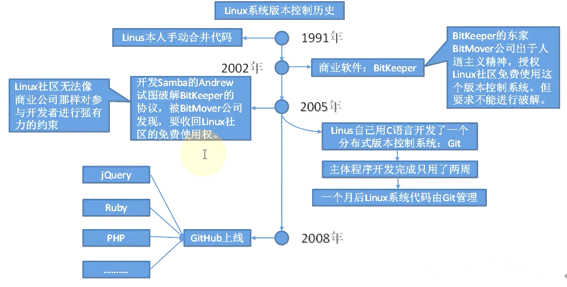

# Git 概述
官网地址：[http://git-scm.com/](http://git-scm.com/)

Git 是一个**免费**的、**开源**的 分布式版本控制系统，可以快速高效地处理从小型到大型的各种项目
Git 易于学习，占地面积小，**性能极快**。它具有廉价的本地库，方便的暂存区域和多个工作流分支等特性
其性能优于 Subversion、CVS、Perforce 和 ClearCase 等版本控制工具

## 1.1 何为版本控制？
版本控制是一种记录文件内容变化，以便将来查阅特定版本修订情况的系统
版本控制其实最重要的是可以记录文件修改**历史记录**，从而让用户能够查看历史版本，方便版本切换

**为什么需要版本控制？**

个人开发过渡到团队协作

## 1.2 版本控制工具

### 集中式版本控制工具

CVS、SVN（Subversion）、VSS.......
集中化的版本控制系统诸如 CVS、SVN 等，都有一个单一的集中管理的服务器，保存所有文件的修订版本，
而协同工作的人们都通过客户端连到这台服务器，取出最新的文件或者提交更新。多年以来，这已成为版本控制系统的标准做法
这种做法带来了许多好处，每个人都可以在一定程度上看到项目中的其他人正在做些什么。
而管理员也可以轻松掌控每个开发者的权限，并且管理一个集中化的版本控制系统，要远比在各个客户端上维护本地数据库来得轻松容易
事分两面，有好有坏。这么做显而易见的缺点是中央服务器的单点故障。如果服务器宕机一小时，那么在这一小时内，谁都无法提交更新，也就无法协同工作
**总结**
- **优点**：可以看到其他人正在做些什么；开发者权限控制
- **缺点**：中央服务器的单点故障，无法提交历史记录
- 

###分布式版本控制工具

Git、Mercurial、Bazaar、Darcs.......
像 Git 这种分布式版本控制工具，客户端提取的不是最新版本的文件快照，而是把代码仓库完整地镜像下来（本地库）。
这样任何一处协同工作用的文件发生故障，事后都可以用其他客户端的本地仓库进行恢复。
因为每个客户端的每一次文件提取操作，实际上都是一次对整个文件仓库的完整备份,分布式的版本控制系统出现之后，解决了集中式版本控制系统的缺陷：

**系统的缺陷**
- 服务器断网的情况下也可以进行开发（因为版本控制是在本地进行的）
- 每个客户端保存的也都是整个完整的项目（包含历史记录，更加安全）
- 
**优点**：
- 版本控制在本地，可以断网开发
- 保存完整项目，包含历史记录，更安全

## 1.3 Git 工作机制

- **工作区**写代码，通过`git add`命令添加至**暂存区**
- **暂存区**临时存储代码，通过`git commit`提交至**本地库**
- **本地库**记录历史记录，通过`git push`推送至**远程库**

## 1.4、Git和代码托管中心

代码托管中心是基于网络服务器的远程代码仓库，一般我们简单称为**远程库**

- 局域网
    - :ballot_box_with_check: GitLab
- 互联网
    - :ballot_box_with_check: GitHub（外网）
    - :ballot_box_with_check: Gitee码云（国内网站）