# Git 基础知识简介

Git 是一个开源的分布式版本控制系统，用于敏捷高效地处理任何或小或大的项目。Git 是 Linus Torvalds 为了帮助管理 Linux 内核开发而开发的一个开放源码的版本控制软件。
Git 与常用的版本控制工具 CVS, Subversion 等不同，它采用了分布式版本库的方式，不必服务器端软件支持。

# 一、git的作用

## 1.1 git的由来和控制工具

Git 不仅仅是个版本控制系统，它也是个内容管理系统(CMS)，工作管理系统等。如果你是一个具有使用 SVN 背景的人，你需要做一定的思想转换，来适应 Git 提供的一些概念和特征。

**Git 与 SVN 区别点：**

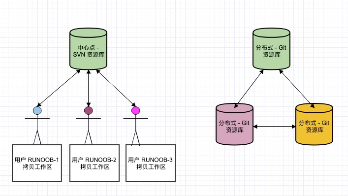

1. Git 是分布式的，SVN 不是：这是 Git 和其它非分布式的版本控制系统，例如 SVN，CVS 等，最核心的区别。
2. Git 把内容按元数据方式存储，而 SVN 是按文件：所有的资源控制系统都是把文件的元信息隐藏在一个类似 .svn、.cvs 等的文件夹里。
3. Git 分支和 SVN 的分支不同：分支在 SVN 中一点都不特别，其实它就是版本库中的另外一个目录。
4. Git 没有一个全局的版本号，而 SVN 有：目前为止这是跟 SVN 相比 Git 缺少的最大的一个特征。
5. Git 的内容完整性要优于 SVN：Git 的内容存储使用的是 SHA-1 哈希算法。这能确保代码内容的完整性，确保在遇到磁盘故障和网络问题时降低对版本库的破坏。

# 二、 git的基本工作原理

## 2.1 git的基本的概念

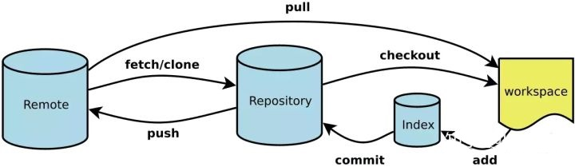

- **Workspace：工作区**

程序员进行开发改动的地方，是你当前看到的，也是最新的。平常我们开发就是拷贝远程仓库中的一个分支，基于该分支进行开发。在开发过程中就是对工作区的操作。

- **Index / Stage：暂存区**

.git目录下的index文件, 暂存区会记录git add添加文件的相关信息(文件名、大小、timestamp...)，不保存文件实体, 通过id指向每个文件实体。
可以使用git status查看暂存区的状态。暂存区标记了你当前工作区中，哪些内容是被git管理的。当你完成某个需求或功能后需要提交到远程仓库，
那么第一步就是通过git add先提交到暂存区，被git管理。

- **Repository：仓库区（或本地仓库）**

保存了对象被提交 过的各个版本，比起工作区和暂存区的内容，它要更旧一些。git commit后同步index的目录树到本地仓库，方便从下一步通过git push同步本地仓库与远程仓库的同步。

- **Remote：远程仓库**

远程仓库的内容可能被分布在多个地点的处于协作关系的本地仓库修改，因此它可能与本地仓库同步，也可能不同步，但是它的内容是最旧的。

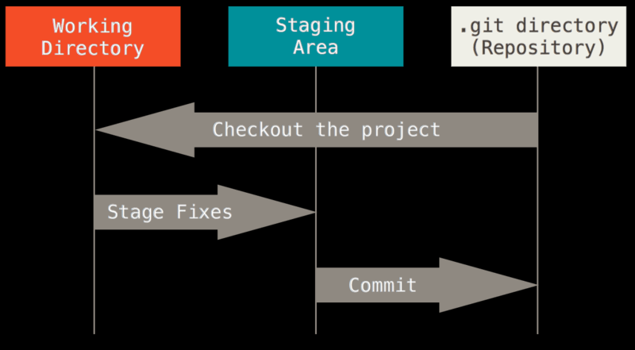

- **已提交(committed)**

已提交表示数据已经安全的保存在本地数据库中。 

- **已修改(modified)**

已修改表示修改了文件，但还没保存到数据库中。

- **已暂存(staged)**

已暂存表示对一个已修改文件的当前版本做了标记，使之包含在下次提交的快照中。


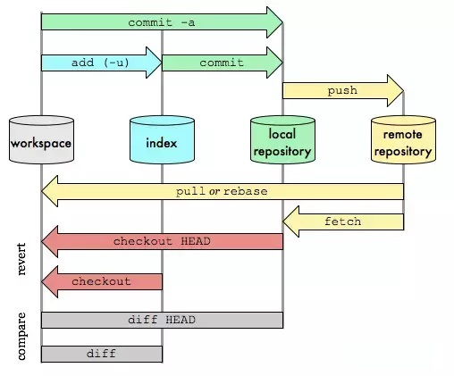

## 2.2 git基本原理

Git 和其它版本控制系统(包括 Subversion 和近似工具)的主要差别在于Git对待数据的方法。 概念上来区分，
其它大部分系统以文件变更列表的方式存储信息。 这类系统(CVS、Subversion、Perforce、Bazaar 等等)将它们保存的信息看作是一组基本文件和每个文件随时间逐步累积的差异。
存储每个文件与初始版本的差异，如下图所示：

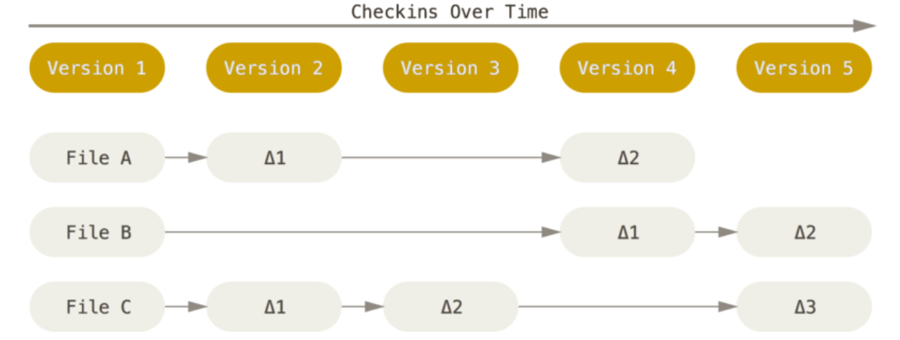

Git 不按照以上方式对待或保存数据。 反之，Git 更像是把数据看作是对小型文件系统的一组快照。 每次你提交更新，或在 Git 中保存项目状态时，
它主要对当时的全部文件制作一个快照并保存这个快照的索引。 为了高效，如果文件没有修改，
Git 不再重新存储该文件，而是只保留一个链接指向之前存储的文件。 Git 对待数据更像是一个快照流。如下图所示：

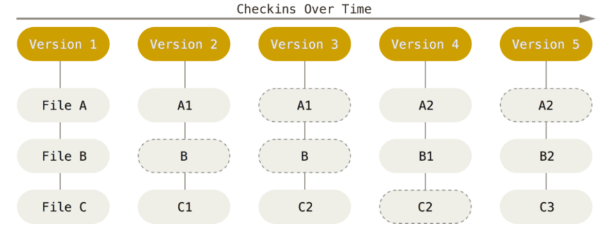

# 三、Git的安装与配置

## 3.1 ubuntu 安装git

一般在Ubuntu系统中带有git软件，可以直接使用即可。
```shell
#安装git
sudo apt-get install git
#查看是否安装成功
git --version
```

## 3.2 window 安装git

查看 GNU 协议，可以直接点击下一步

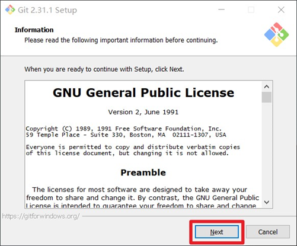

选择 Git 安装位置，要求是非中文并且没有空格的目录，然后下一步

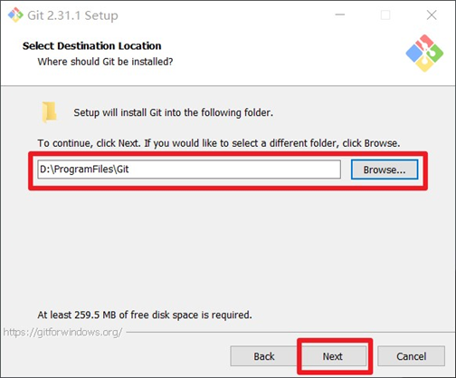

Git 选项配置，推荐默认设置，然后下一步

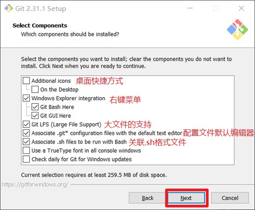

Git 安装目录名，不用修改，直接点击下一步

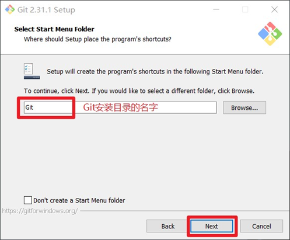

Git 的默认编辑器，建议使用默认的 Vim 编辑器，然后点击下一步

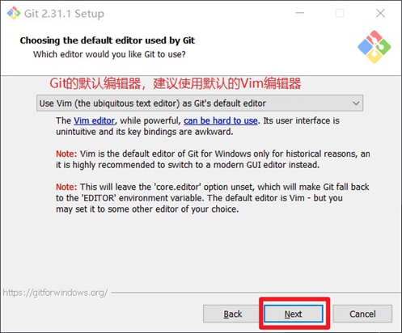

默认分支名设置，选择让 Git 决定，分支名默认为 master，下一步

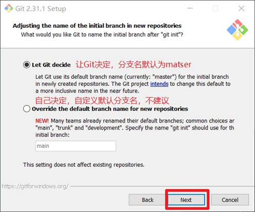

修改 Git 的环境变量，选第一个，不修改环境变量，只在 Git Bash 里使用 Git

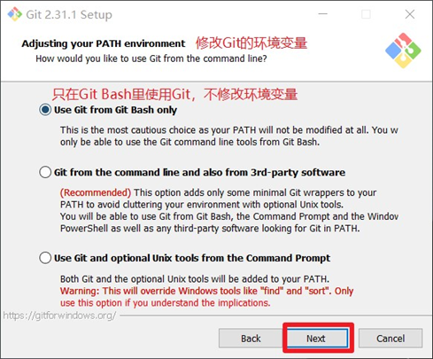

选择后台客户端连接协议，选默认值 OpenSSL，然后下一步

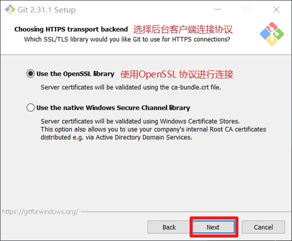

配置 Git 文件的行末换行符，Windows 使用 CRLF，Linux 使用 LF，选择第一个自动转换，然后继续下一步

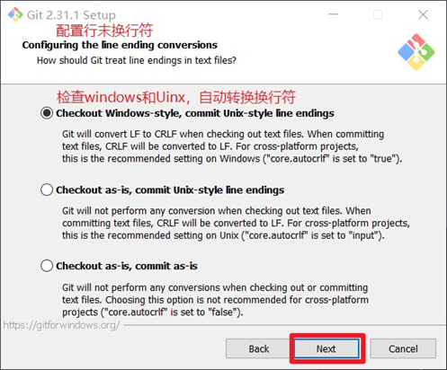

选择 Git 终端类型，选择默认的 Git Bash 终端，然后继续下一步

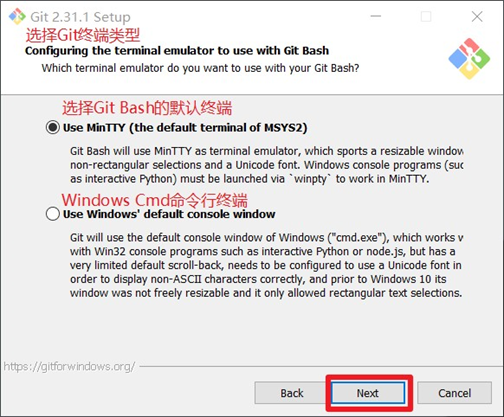

选择 Git pull 合并的模式，选择默认，然后下一步

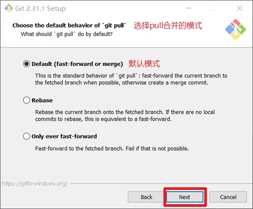

选择 Git 的凭据管理器，选择默认的跨平台的凭据管理器，然后下一步

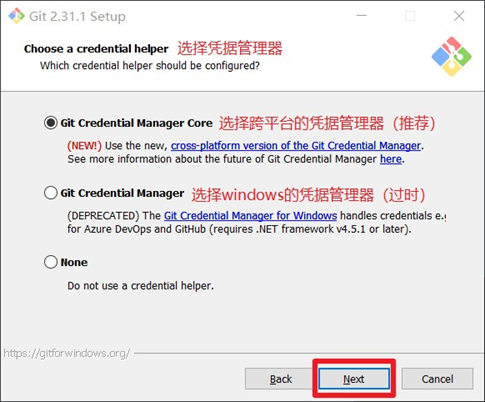

其他配置，选择默认设置，然后下一步

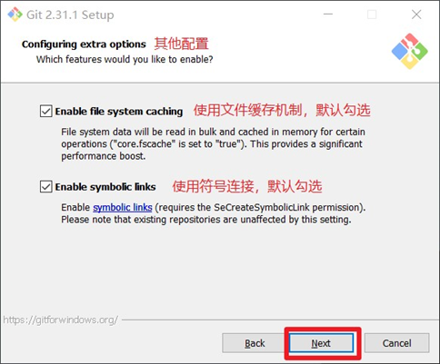

实验室功能，技术还不成熟，有已知的 bug，不要勾选，然后点击右下角的 Install 按钮，开始安装 Git

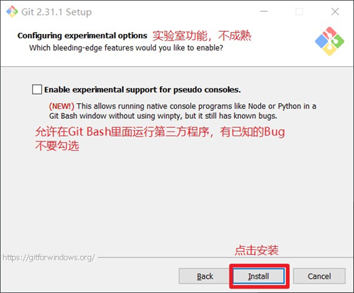

点击 Finsh 按钮，Git 安装成功！

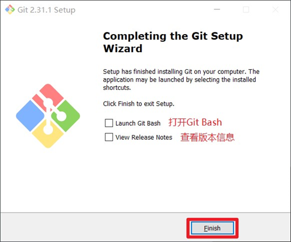

右键任意位置，在右键菜单里选择 Git Bash Here 即可打开 Git Bash 命令行终端

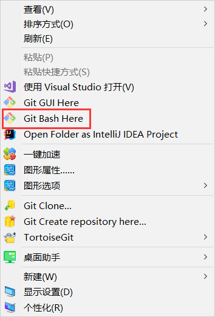

在 Git Bash 终端里输入 `git --version` 查看 git 版本，如图所示，说明 Git 安装成功

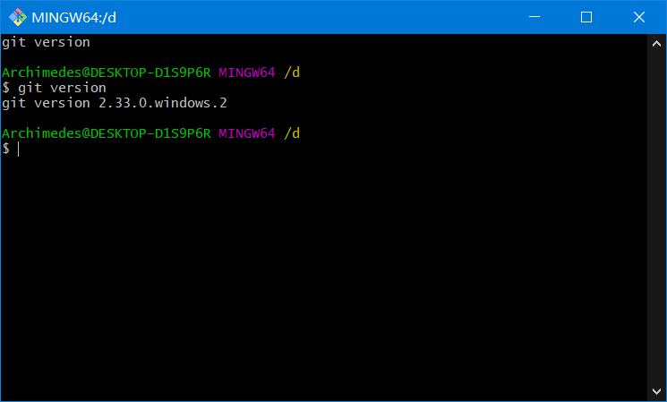

# 博文参考

- 官网地址：[https://git-scm.com/](https://git-scm.com/)

