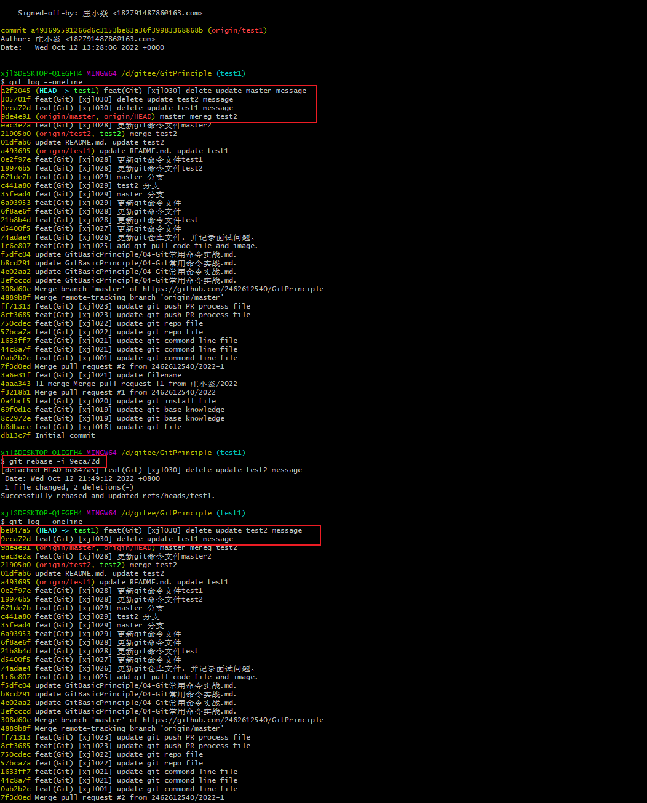

# Git的基本的命令操作

#一、 Git 基本命令语法

## 1.1 Git config命令

```bash
git --version  					   #Git版本
git update-git-for-windows		           #升级版本
git config --system [--unset] user.name 用户名     #设置/删除用户签名（全局）
git config --system [--unset] user.email 邮箱      #设置/删除用户签名（全局） 
git config --global [--unset] user.name 用户名     #设置/删除用户签名（用户）
git config --global [--unset] user.email 邮箱      #设置/删除用户签名（用户）
git config [--unset] user.name 用户名              #设置/删除用户签名（项目）
git config [--unset] user.email 邮箱               #设置/删除用户签名（项目）   
git config --unset credential.helper               #重置凭证
git config --system gui.encoding utf-8             #编码设置（全局）
git config --system i18n.commitEncoding utf-8      #编码设置（全局）
git config --system i18n.logoutputencoding utf-8   #编码设置（全局）
git config --global gui.encoding utf-8             #编码设置（用户）
git config --global i18n.commitEncoding utf-8      #编码设置（用户）
git config --global i18n.logoutputencoding utf-8   #编码设置（用户）
git config gui.encoding utf-8                      #编码设置（项目）
git config i18n.commitEncoding utf-8               #编码设置（项目）
git config i18n.logoutputencoding utf-8            #编码设置（项目）
git config --system alias.别名 命令参数             #设置命令别名（全局）
git config --global alias.别名 命令参数             #设置命令别名（用户）
git config alias.别名 命令参数                      #设置命令别名（项目） 
git config --system --list                         #查看所有配置（全局）
git config --global --list                         #查看所有配置（用户）
git config --list                                  #查看所有配置（项目）
git init                                           #初始化本地库
```

## 1.2 Git 状态命令

```bash
git status         #查看本地库状态
git diff           #查看那些更新还没有暂存
git diff --cached  #查看哪些暂存还没有提交
git diff --staged  #查看哪些暂存还没有提交
```

## 1.3 Git 提交命令

```bash
git add 文件名                    #添加至暂存区
git commit [文件名]               #提交至本地库
git commit -m "日志信息" [文件名]
git commit -a
git commit -a -m "日志信息"
git reset --soft commithash      #HEAD
git reset [--mixed] commithash   #HEAD、暂存区
git reset --hard commithash      #HEAD、暂存区、工作区（版本穿梭）
```

## 1.4 Git 查看历史记录

```bash
git reflog                                 #引用日志
git log -g                                 #引用日志（详细）
git log                                    #详细日志
git log --pretty=oneline                   #一行化
git log --oneline                          #一行化并精简hash
git log --oneline --decorate               #查看当前分支所指对象
git log --oneline --decorate --graph --all #查看所有分支历史
```

## 1.5 Git 分支操作

```bash
git branch -b 新的分支名             #创建新的分支
git branch                         #查看当前分支
git checkout 其他分支名              #切换其他分支
git merge 分支名                    #合并分支名
git branch -D/-d name              #(强制)删除本地分支
git push origin --delete 分支名     #(强制)删除远端分支
```

## 1.6 Git 撤回与重置

```bash
git checkout -- file            #撤回修改
git reset [--mixed HEAD] file   #撤回暂存
git commit --amend              #重置commit信息
git reset --soft commithash     #重置HEAD
git reset [--mixed] commithash  #重置HEAD、暂存区
git reset --hard commithash     #重置HEAD、暂存区、工作区
```

## 1.7 Git 远程操作

```bash
git remote add 别名 远程地址             #定义别名
git remote set-url --add 别名 远程地址   #同一别名添加多个远程地址
git remote -v                           #查看所有别名
git clone 远程地址                       #克隆仓库
git pull 别名 分支名                     #拉取分支
git push 别名 分支名                     #推送分支
git branch -vv                          #查看所有远程跟踪分支
git branch -u 远程跟踪分支名              #本地分支跟踪远程分支
git checkout -b 本地分支名 远程跟踪分支名  #创建本地分支并跟踪远程分支
git checkout --track 远程跟踪分支名       #创建本地分支并跟踪远程分支
```

## 1.8 其他命令

```bash
git rm 文件名               #移除文件并暂存
git mv 原文件名 新文件名      #重命名文件并暂存
git stash                  #命令会将未完成的修改保存到一个栈上，而你可以在任何时候重新应用这些改动(git stash apply) 
git stash list             #查看存储
git stash apply stash@{2}  #如果不指定一个储藏，Git认为指定的是最近的储藏
git stash drop             #加上将要移除的储藏的名字来移除它
git stash pop              #来应用储藏然后立即从栈上扔掉它
ssh-keygen -t rsa [-C 描述] #SSH免密登录生成密钥
ssh -T git@github.com       #测试配置是否成功
```

## 1.9 基本命令

```bash
git remote -v   #查看信息 

origin  https://github.com/tianqixin/runoob-git-test (fetch)
origin  https://github.com/tianqixin/runoob-git-test (push) 
```

```bash
git remote add origin git@github.com:tianqixin/runoob-git-test.git   #添加远程版本库

origin  https://github.com/tianqixin/runoob-git-test (fetch)
origin  https://github.com/tianqixin/runoob-git-test (push) 

git remote add upstream *****.git     #添加远程版本库 

upstream  https://github.com/tianqixin/runoob-git-test (fetch)
upstream  https://github.com/tianqixin/runoob-git-test (push) 

git remote rm name  # 删除远程仓库

git remote rename old_name new_name  # 修改仓库名
```

```bash
git fetch origin    # 你想要从origin提取更新的数据

git fetch origin 仓库的分支名   # 将远端仓库的分支的拉取暂存区 
git rebase origin/仓库的分支名  # 将远端仓库的分支于当前分支合并没有记录
git merege origin/仓库的分支名  # 将远端仓库的分支于当前分支合并同时有新的提交记录
git fetch upstream  # 你想要从upstream提取更新的数据
```

```bash
git merge origin    # 从远端仓库提取数据并尝试合并到当前分支（所有的分支）
git merge origin branch #从origin branch提取数据并尝试合并到当前分支
git pull origin master  的操作就相当于 git fetch origin master 和 git merge origin/master 这两步操作
git merge origin branchA 相当于 git merge origin/master branchA
```

```bash
git merge origin(远程master分支) master(本地分支master) # 是将远程分支master在本地的副本和本地的master分支合并到当前分支
git merge origin/master                              # 是合并远程分支master在本地的副本
```

```bash
git merge branchA branchB branchC ....    # git merge 后面跟的都是要合并到**当前分支**的分支名称，不存在要合并到其他分支上的意思
```

```bash
#参数base-commit就是指明操作的基点提交对象，基于这个基点进行 rebase 的操作，我们要把最后的一个提交对象（base-commit）之前的提交压缩成一次提交

git rebase -i <base-commit>  

```

