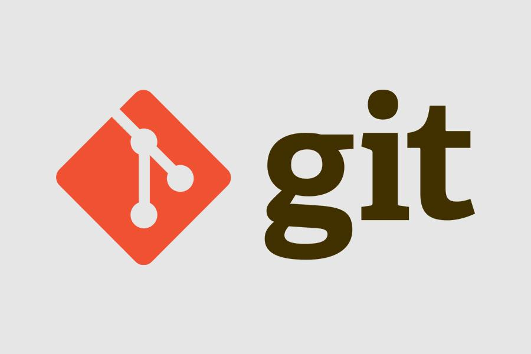
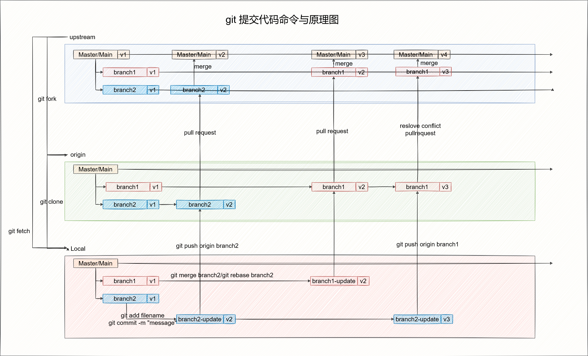

# Git-Principle

master

本项目主要是介绍git的相关原理和工作实践问题与解决方案

-----------------------------------------------------------------------------------------------
其他平台将同步更新

- Github：https://github.com/2462612540
- Gitee：https://gitee.com/xjl2462612540
- CSDN：https://blog.csdn.net/weixin_41605937?spm=1001.2014.3001.5343

<mark>**整理不易，还望各位看官一键三连 :heart: :heart: :heart: **</mark>

<mark>**整理不易，还望各位看官一键三连 :heart: :heart: :heart: **</mark>

-----------------------------------------------------------------------------------------------

## Git Xmind

## Git Basic Principle
- 01-git的基本概述
- 02-git的安装
- 03-git的基本的命令
- 04-git常用命令实战

## Git Project
- git的命令集合
- git的冲突解决
- git的多commit合并
- git的PR的流程
- git的版本回退
- git的自动多次提交

## Git Interview Questions

# Project Summary

本项目所有内容来源于个人总结而形成。同时大部分内容是学习互联网上的相关知识和翻阅相关书籍原著获得，所以在一些知识的理解上可能存在错误，肯请各位大佬及时指出。
另外项目中部分图像是直接引用而来，如果涉及到相关的版权问题，请及时联系我我的邮箱是：18279148786@163.com 本人将立即改正。